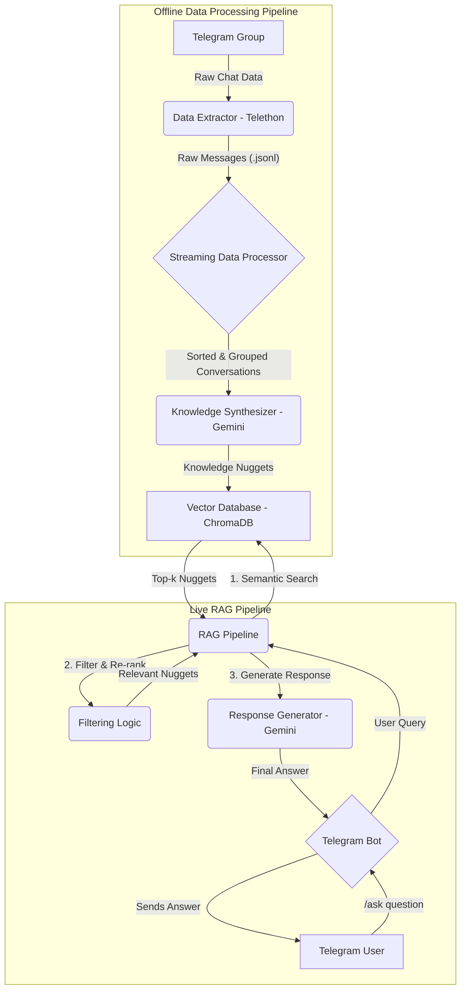

# RAG-Powered Telegram Bot for Community Support

This project is an LLM-powered Telegram bot that uses a Retrieval-Augmented Generation (RAG) pipeline to answer questions based on the chat history of a Telegram group.

## Project Architecture

The system is composed of two main parts: an offline processing pipeline that builds a knowledge base from the chat history, and a live Telegram bot that uses the knowledge base to answer user questions.



## Setup and Usage

### 1. Prerequisites

*   Python 3.10+
*   Telegram account
*   Google Gemini API keys

### 2. Installation

1.  **Clone the repository:**
    ```bash
    git clone <repository-url>
    cd <repository-directory>
    ```

2.  **Create a virtual environment and install dependencies:**
    ```bash
    python -m venv .venv
    source .venv/bin/activate
    pip install -r requirements.txt
    ```

3.  **Set up your credentials:**
    *   Create a `.env` file by copying the `.env.example` file.
    *   **For Data Extraction:** Get your personal `api_id` and `api_hash` from [my.telegram.org](https://my.telegram.org).
    *   **For Live Bot:** Create a new bot with [@BotFather](https://t.me/botfather) to get your `TELEGRAM_BOT_TOKEN`.
    *   Add your Google Gemini API keys to the `.env` file.

### 3. Running the Project

1.  **Start the LiteLLM Proxy:**
    The LiteLLM proxy is used to manage the Gemini API keys and provide a single endpoint for the application. To start the proxy, run the following command in a separate terminal:
    ```bash
    litellm --config src/utils/litellm_config.yaml
    ```

2.  **Build the Knowledge Base:**
    The data pipeline consists of three steps that should be run in order:
    ```bash
    # 1. Extract raw message history from Telegram
    python -m src.scripts.extract_history

    # 2. Process raw messages into structured conversations
    python -m src.scripts.process_data

    # 3. Synthesize conversations into knowledge nuggets and store them in the DB
    python -m src.scripts.synthesize_knowledge
    ```

3.  **Run the Telegram Bot:**
    Once the knowledge base has been built, you can start the Telegram bot by running the following command:
    ```bash
    python -m src.bot.main
    ```

## Logging & Environment

- All scripts use a centralized logging configuration located at `src/utils/logger.py` and write rotating logs to the `logs/` directory (file: `logs/chatbot.log`).
- Keep `USE_LOCAL_FILE_CACHE=false` in production; local file caches are intended for development only. The example env file `.env.example` reflects this default.
- Run `src/scripts/check_litellm_setup.py` (with PYTHONPATH set to the project root) to get a proxy-informed recommendation for `REQUESTS_PER_MINUTE` before running large synthesis jobs.

## Deployment

The recommended deployment platform for this project is the **Oracle Cloud Free Tier**, as it provides an always-on compute instance and persistent disk storage for free.
