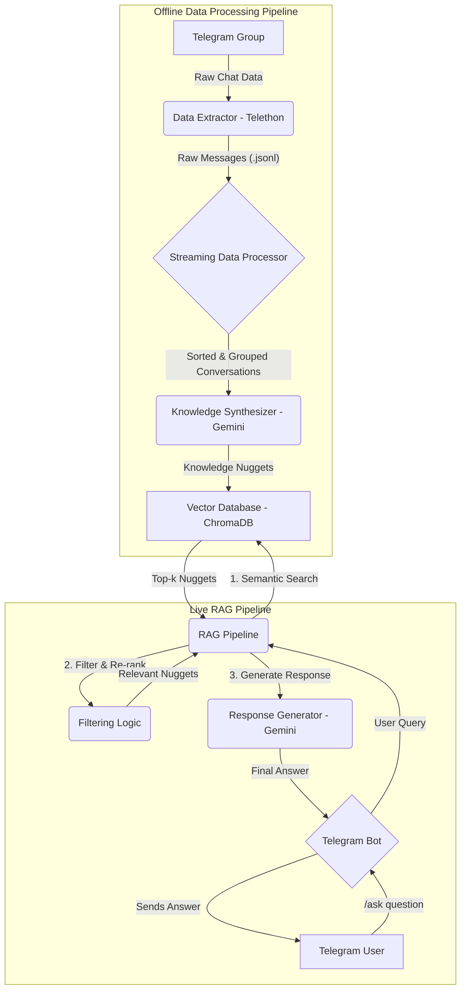

# Project Workflow & Architecture: RAG-Powered Telegram Bot

## 1. Project Overview

This document provides a comprehensive overview of the RAG-powered Telegram bot, a system designed to function as a community support assistant. The bot leverages a Retrieval-Augmented Generation (RAG) pipeline to answer user questions based on the chat history of a designated Telegram group.

The core purpose of this bot is to provide accurate, timely, and context-aware answers to user queries by synthesizing information from past conversations. It is designed to handle the fluid nature of community discussions, where information can be updated or corrected over time.

This document serves as a central knowledge base for the project, detailing its architecture, data processing workflows, and design patterns. It is intended for developers, maintainers, and anyone interested in understanding the inner workings of the system.

## 2. System Architecture

The system is composed of two main pipelines: an **Offline Data Processing Pipeline** and a **Live RAG Pipeline**.

-   **Offline Pipeline:** This pipeline is responsible for extracting chat history from Telegram, processing it into a structured format, and synthesizing it into a knowledge base of "Knowledge Nuggets." These nuggets are then stored in a ChromaDB vector store.
-   **Live Pipeline:** This pipeline is part of the live Telegram bot. It takes a user's question, queries the knowledge base to retrieve relevant nuggets, and generates a final answer using the Gemini API.

Below is a Mermaid diagram illustrating the complete system architecture:



## 3. Offline Data Processing Pipeline

The offline pipeline is a multi-step process that transforms raw, unstructured chat data into a structured and searchable knowledge base. This process is designed to be run periodically to keep the knowledge base up-to-date with the latest conversations.

### 3.1. Data Extraction

-   **Tool:** `Telethon`
-   **Script:** `src/scripts/extract_history.py`
-   **Process:**
    1.  The `extract_history.py` script uses the Telethon library to connect to a personal Telegram account.
    2.  It fetches the entire message history from the specified Telegram group(s) (defined in `src/utils/config.py`).
    3.  The raw message data (including message ID, text, sender ID, and timestamp) is saved to a JSON file.

### 3.2. Conversation Thread Building

-   **Tool:** `Python`
-   **Script:** `src/scripts/process_data.py`
-   **Process:**
    1.  The `process_data.py` script reads the raw `.jsonl` files in a streaming fashion.
    2.  It performs an external sort on the messages to handle large volumes of data without high memory usage.
    3.  It then groups messages into conversation threads based on reply chains and temporal proximity.
    4.  The output is a structured JSON file (`processed_conversations.json`) containing a list of these conversation threads.

### 3.3. Knowledge Synthesis

-   **Tool:** `Gemini API` (via `litellm`)
-   **Script:** `src/scripts/synthesize_knowledge.py`
-   **Process:**
    1.  The `synthesize_knowledge.py` script iterates through the processed conversation threads.
    2.  For each thread, it constructs a detailed prompt using the template in `docs/knowledge_synthesis_prompt.md`.
    3.  It sends the prompt to the Gemini API to generate a "Knowledge Nugget" that conforms to the `docs/knowledge_nugget_schema.md`.
    4.  The `detailed_analysis` of the generated nugget is then embedded using the Gemini embedding model.
    5.  Finally, the embedding and the full nugget (as metadata) are stored in the ChromaDB vector database.

## 4. Knowledge Nugget Schema

The "Knowledge Nugget" is the core data object for the bot's knowledge base. This schema is designed to capture not just information, but also its context, relevance, and reliability.

### 4.1. Rationale

The goal is to move beyond simple Question/Answer pairs and create a richer data format that allows for more sophisticated retrieval and generation. By storing summaries, analysis, and metadata like timestamps and status, the RAG system can make better decisions about what information is relevant and trustworthy.

### 4.2. Schema Definition

A "Knowledge Nugget" is a JSON object with the following structure:

```json
{
  "topic": "string",
  "timestamp": "string <ISO 8601>",
  "topic_summary": "string",
  "detailed_analysis": "string",
  "status": "string <enum: 'FACT', 'SPECULATION', 'COMMUNITY_OPINION'>",
  "keywords": ["string"],
  "source_message_ids": ["integer"],
  "user_ids_involved": ["string"]
}
```

### 4.3. Field Descriptions

| Field Name | Type | Description | Example |
| :--- | :--- | :--- | :--- |
| `topic` | String | A short, descriptive title for the conversation topic. | `"Oracle Cloud Free Tier Setup"` |
| `timestamp` | String | The ISO 8601 timestamp of the **last** message in the conversation, indicating recency. | `"2025-08-01T12:45:00Z"` |
| `topic_summary` | String | A concise, one-sentence summary of the core topic or question. | `"How to configure the Oracle Cloud Free Tier for a Telegram bot."` |
| `detailed_analysis` | String | A comprehensive, multi-sentence explanation derived from the conversation. This is the primary content returned to the user. | `"Users confirmed that the best approach is to use an 'Always Free' Ampere A1 Compute instance..."` |
| `status` | Enum | The reliability of the information. | `"FACT"` |
| `keywords` | Array[String] | A list of key terms and entities to aid in keyword-based or hybrid search. | `["oracle cloud", "free tier", "deployment", "systemd"]` |
| `source_message_ids` | Array[Int] | An array of message IDs from the source conversation that were used to generate this nugget. | `[101, 102, 105, 110]` |
| `user_ids_involved` | Array[String] | Anonymized user IDs (e.g., "User_1") of the participants. | `["User_1", "User_5", "User_12"]` |

### 4.4. ChromaDB Storage Strategy

To effectively leverage the Knowledge Nugget schema in our RAG pipeline, we will adopt the following storage strategy in ChromaDB:

-   **Document for Embedding:** The `detailed_analysis` field will be used as the primary document for generating embeddings. It provides a richer context for semantic search.
-   **Metadata:** All other fields from the schema will be stored in the metadata payload associated with each embedding.
-   **ID:** A dynamically generated UUID will be used as the unique identifier for each entry in the collection.

## 5. Live RAG Pipeline

The live RAG pipeline is the heart of the Telegram bot, responsible for generating real-time answers to user queries. It follows a multi-stage process to ensure that the generated responses are relevant, accurate, and up-to-date.

### 5.1. Query Embedding

-   **Tool:** `Gemini Embedding Model` (via `litellm`)
-   **Script:** `src/core/rag_pipeline.py`
-   **Process:**
    1.  When a user sends a message to the bot, the `handle_message` function in `src/bot/main.py` is triggered.
    2.  The user's query is passed to the `RAGPipeline`.
    3.  The `embed_query` method generates a vector embedding of the user's query using the Gemini embedding model.

### 5.2. Two-Stage Retrieval

This is the most critical part of the pipeline, where we leverage the rich metadata of our Knowledge Nuggets.

#### 5.2.1. Stage 1: Semantic Search

-   **Tool:** `ChromaDB`
-   **Process:**
    1.  The query embedding is used to perform a similarity search on the ChromaDB collection.
    2.  The `collection.query` method retrieves the top-k most semantically similar Knowledge Nuggets (e.g., k=10).
    3.  This initial set of results is based on the similarity of the user's query to the `topic_summary` of the nuggets.

#### 5.2.2. Stage 2: Filtering & Re-ranking (Proposed Implementation)

-   **Tool:** `Python`
-   **Process:**
    1.  The retrieved nuggets are then processed by a custom re-ranking algorithm.
    2.  **Filtering:** Any nuggets with a `status` of `'OUTDATED'` are removed from consideration.
    3.  **Re-ranking:** The remaining nuggets are assigned a score based on a weighted combination of:
        -   **Recency:** A granular scoring mechanism is applied based on the `last_message_timestamp`. More recent nuggets receive a higher score.
        -   **Status:** A predefined weight is assigned to each `status` (e.g., `FACT` > `COMMUNITY_OPINION` > `SPECULATION`).
        -   **Semantic Score:** The original similarity score from ChromaDB is also factored in.
    4.  The nuggets are then re-sorted based on this new score, and the top-n (e.g., n=5) are selected as the final context. The weights for each score component are configurable in `src/utils/config.py`.

### 5.3. Response Generation

-   **Tool:** `Gemini API` (via `litellm`)
-   **Process:**
    1.  The `detailed_analysis` from the top-ranked nuggets is combined to form the final context.
    2.  This context is inserted into a system prompt that instructs the model to synthesize an answer based *only* on the provided information.
    3.  The `litellm.completion` method sends the prompt and the user's query to the Gemini API.
    4.  The generated response is then sent back to the user via the Telegram bot.

## 6. Setup and Deployment

This section provides instructions for setting up the project for local development and deploying it to a production environment.

### 6.1. Local Setup

1.  **Prerequisites:**
    *   Python 3.10+
    *   A Telegram account
    *   Google Gemini API keys

2.  **Installation:**
    *   Clone the repository.
    *   Create and activate a virtual environment.
    *   Install the required dependencies: `pip install -r requirements.txt`

3.  **Configuration:**
    *   Create a `.env` file from the `.env.example` template.
    *   Fill in your Telegram `api_id`, `api_hash`, and `TELEGRAM_BOT_TOKEN`.
    *   Add your Google Gemini API keys.

4.  **Running the System:**
    *   **Start the LiteLLM Proxy:** In a separate terminal, run `litellm --config src/utils/litellm_config.yaml`. This proxy manages your API keys and provides a unified endpoint.
    *   **Build the Knowledge Base:** Run `python -m src.scripts.synthesize_knowledge` to process the chat history and populate the vector database.
    *   **Start the Bot:** Run `python -m src.bot.main` to start the live Telegram bot.

### 6.2. Deployment

The recommended deployment platform is the **Oracle Cloud Free Tier**, which provides an "Always Free" compute instance with persistent storage.

1.  **Provision the Server:**
    *   Create an Oracle Cloud account and provision an Ampere A1 Compute instance.
    *   Choose a suitable operating system (e.g., Ubuntu).

2.  **Set up the Environment:**
    *   SSH into the server.
    *   Install Python (preferably using `pyenv` for version management).
    *   Clone the repository and install the dependencies as described in the local setup.

3.  **Run as a Service:**
    *   To ensure the bot and the proxy run continuously, they should be managed as systemd services.
    *   Create systemd service files for both the LiteLLM proxy and the main bot (`src/bot/main.py`).
    *   This will allow the services to start automatically on boot and restart if they crash.

## 7. Future Improvements

This project has a solid foundation, but there are several areas where it can be improved and extended.

### 7.1. Implement Re-ranking Logic

-   **Priority:** High
-   **Description:** The most critical next step is to implement the filtering and re-ranking logic described in the Live RAG Pipeline section. This will fully leverage the `status` and `timestamp` fields in the Knowledge Nugget schema, leading to more accurate and timely answers.

### 7.2. Hybrid Search

-   **Priority:** Medium
-   **Description:** Currently, the retrieval is based purely on semantic similarity. Implementing a hybrid search that combines semantic search with traditional keyword search (using the `keywords` field) could improve retrieval for queries that contain specific, technical terms.

### 7.3. Automated Knowledge Curation

-   **Priority:** Medium
-   **Description:** The `synthesize_knowledge.py` script could be enhanced to automatically identify and mark outdated information. For example, if a new nugget is generated that contradicts an existing one, the old nugget's `status` could be automatically changed to `'OUTDATED'`.

### 7.4. User Feedback Loop

-   **Priority:** Low
-   **Description:** A mechanism could be added for users to provide feedback on the bot's answers (e.g., with thumbs up/down buttons). This feedback could be used to fine-tune the re-ranking algorithm or identify areas where the knowledge base is weak.

### 7.5. Dependency Management

-   **Priority:** Low
-   **Description:** The `requirements.txt` file is quite large. It would be beneficial to review the dependencies and remove any that are not strictly necessary. Using a tool like `pip-tools` could help manage dependencies more effectively.
