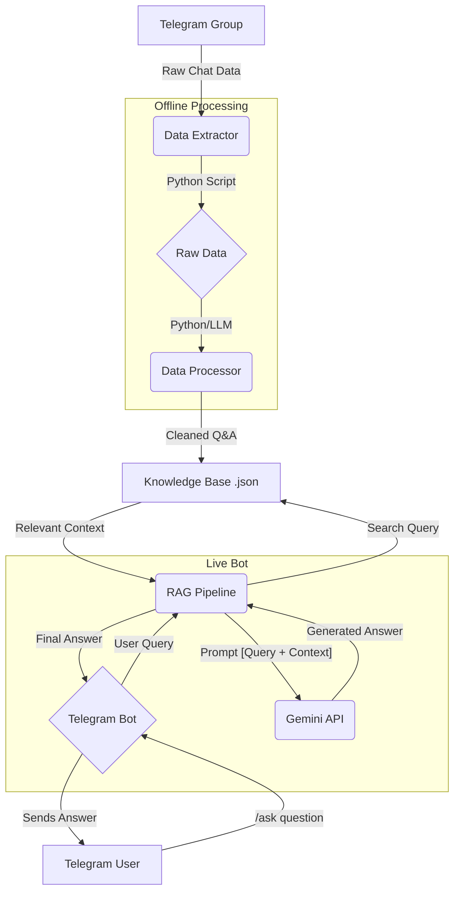

# Telegram Bot Project: Action Plan

This document outlines the step-by-step plan to build the LLM-powered Telegram bot for community support.

## Project Architecture

Here is a high-level overview of the system architecture:



## Development Phases

### Phase 1: Project Setup & Data Extraction
-   [ ] **1.1: Set up Python virtual environment and install initial dependencies.**
    -   Create a `requirements.txt` file.
    -   Dependencies: `python-telegram-bot`, `google-generativeai`, `python-dotenv`.
-   [ ] **1.2: Create a new Telegram bot using BotFather.**
    -   Get the API token.
    -   Create a `.env` file to store the token securely.
-   [ ] **1.3: Write a Python script (`extract_history.py`) to extract chat history.**
    -   Use the Telegram API (via `python-telegram-bot` or another library) to connect.
    -   Handle authentication and connect to the target group.
    -   Fetch and save the chat history to a raw text or JSON file.

### Phase 2: Data Processing & Knowledge Base Creation
-   [ ] **2.1: Develop a Python script (`process_data.py`) for advanced data cleaning.**
    -   **Anonymization:** Replace usernames and user IDs with generic placeholders (e.g., `User_A`, `User_B`) to protect privacy.
    -   **Noise Reduction:** Filter out system messages (joins/leaves), stickers, GIFs, and non-text content.
    -   **Content Filtering:** Remove spam, off-topic conversations, and messages that don't contribute to the knowledge base.
    -   **Conversation Grouping:** Group messages into logical conversation threads for contextual analysis.
-   [ ] **2.2: Design a high-quality prompt for Q&A extraction.**
    -   The goal is to create a prompt that instructs the LLM to act as a data analyst. The prompt should guide the model to:
        -   Identify clear questions and their direct, concise answers from a conversation thread.
        -   Ignore conversational filler and irrelevant chatter.
        -   Extract the information into a structured JSON format, like:
            ```json
            {
              "question": "The extracted user question.",
              "answer": "The most direct and accurate answer found in the thread.",
              "confidence_score": 0.9,
              "source_thread_id": "thread_123"
            }
            ```
        -   Provide a confidence score on how certain it is that the extracted answer correctly addresses the question.
-   [ ] **2.3: Implement the Q&A extraction and knowledge base population.**
    -   Write a script that feeds the cleaned conversation threads and the master prompt to the Gemini API.
    -   Process the structured JSON output from the LLM.
    -   Generate embeddings for each Q&A pair and store them in the vector database.

### Phase 3: Telegram Bot & RAG Implementation
-   [ ] **3.1: Set up the main bot file (`bot.py`).**
    -   Load API keys from `.env`.
    -   Create handlers for commands like `/start` and `/help`.
    -   Set up the main message handler for answering questions.
-   [ ] **3.2: Implement the RAG (Retrieval-Augmented Generation) pipeline.**
    -   **Retrieval Strategy Decision:**
        -   **Option A (Simple):** Use a JSON file and keyword search. Fast to implement, but low-quality search.
        -   **Option B (Recommended):** Use a vector database (e.g., ChromaDB) for semantic search. Requires learning about embeddings but provides far superior results.
    -   **Retrieval Implementation (Vector DB):**
        -   When a user asks a question, generate an embedding for their query.
        -   Use the vector database to find the most similar documents (Q&A pairs) from the knowledge base.
    -   **Augmentation:** Create a prompt for Gemini that includes the user's original question and the retrieved context from the vector database.
    -   **Generation:** Send the augmented prompt to the Gemini API and get the final answer.
    -   Send the generated answer back to the user on Telegram.

### Phase 4: Deployment & Maintenance
-   [ ] **4.1: Write unit tests.**
    -   Create tests for the data processing functions.
    -   Test the RAG pipeline components.
-   [ ] **4.2: Choose a deployment platform and deploy the bot.**
    -   Review the deployment options below and select the best fit.
    -   Prepare the project for deployment (e.g., creating a `Dockerfile` or `render.yaml`).
-   [ ] **4.3: Set up knowledge base updates.**
    -   Implement a manual `/sync` command in the bot for the admin to trigger updates.
    -   Alternatively, if the chosen platform supports it easily, set up an automated cron job.

### Appendix: Deployment Options Analysis (Deep Research Update for 2025)

This section details the recommended free hosting options for this project, updated with extensive, verified information as of 2025.

**Conclusion:** After a thorough investigation into multiple platforms, **Oracle Cloud Free Tier remains the only identified platform that provides both always-on compute and persistent disk storage for free.** This combination is essential for the project's architecture, which requires a constantly running bot and a persistent vector database.

#### Recommended Option:

1.  **Oracle Cloud Free Tier**
    *   **Hardware:** Always-free Ampere ARM server (up to 4 cores, 24 GB RAM).
    *   **Storage:** 200 GB of persistent block storage.
    *   **Uptime:** True 24/7, no sleeping instances.
    *   **Pros:** Extremely powerful, massive resource limits for a free tier. Meets all project requirements.
    *   **Cons:** More complex initial setup, requires managing a full Linux VM.

#### Investigated & Non-Viable Alternatives:

*   **Fly.io:** Research confirms their free tier no longer includes persistent storage.
*   **Render:** Research confirms their free web services do not support persistent disks.
*   **Deta.space:** Research confirms the service is shutting down and is no longer a viable option.
*   **Railway.app:** Operates on a pay-as-you-go model and does not offer a comprehensive free tier covering our compute and storage needs.
*   **Hugging Face Spaces:** Offers free compute but only ephemeral storage on its free tier. Persistent storage is a paid feature.
